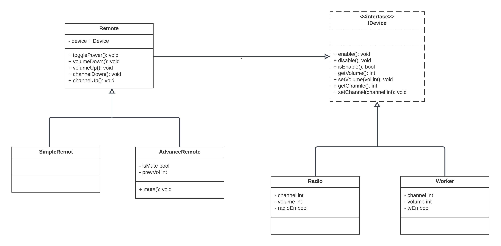

# Bridge Design Pattern

The Bridge Design Pattern is a structural design pattern that separates an object's abstraction from its implementation, allowing them to vary independently. It involves creating two separate hierarchies: one for the abstraction (high-level interface) and one for the implementation (low-level implementation), and then allowing them to work together. The Bridge pattern promotes flexibility, maintainability, and the ability to extend and adapt systems.

## Why Use the Bridge Design Pattern

- **Separation of Concerns**: The Bridge pattern separates the high-level abstraction from the low-level implementation, enabling changes in one to not affect the other. This separation is essential when you want to independently modify or extend either the abstraction or implementation.

- **Flexibility**: It provides the flexibility to add new abstractions or implementations without modifying existing code, making it suitable for evolving systems.

- **Reuse**: The Bridge pattern promotes code reuse, as different abstractions can reuse the same set of implementations, reducing code duplication.

## Real Examples of Bridge Design Pattern

1. **Operating System Windowing Systems**:
    - In the development of operating systems, the Bridge pattern can be used to separate the platform-independent windowing system (abstraction) from the platform-specific windowing system (implementation). This allows the same application to run on different operating systems with minimal code changes.

2. **Graphics Rendering Engines**:
    - In graphics rendering engines, the Bridge pattern can separate the rendering engine (abstraction) from the hardware-specific rendering methods (implementation). This enables the engine to work with different graphics hardware seamlessly.

3. **Database Abstraction Layers**:
    - Database abstraction layers can use the Bridge pattern to separate the high-level database operations (abstraction) from the specific database driver implementations (implementation). This makes it possible to switch between different database systems without affecting the application's core logic.

4. **Remote Controls for Home Entertainment Systems**:
    - In consumer electronics, remote controls for home entertainment systems can apply the Bridge pattern. The remote control represents the high-level interface (abstraction), while the individual devices (TV, radio, DVD player) represent the low-level implementations. This allows users to control various devices using a single remote control.

## Overview of Provided Code

The provided Go code illustrates the Bridge Design Pattern in the context of a remote control system for electronic devices. Here's a brief overview of the code:

- **IDevice Interface**: Defines a set of methods (enable, disable, isEnabled, getVolume, getChannel, setVolume, setChannel) that represent operations common to electronic devices.

- **Radio and TV**: Concrete device implementations (low-level) that implement the IDevice interface. They represent specific devices with power states, volume control, and channel control.

- **Remote**: Represents a generic remote control (abstraction) that operates on devices through the IDevice interface. It includes methods for toggling power, adjusting volume, and changing channels.

- **AdvancedRemote**: Extends the Remote abstraction to include additional functionality like muting and unmuting devices.

- **SimpleRemote**: A simplified remote control without advanced features.  

## Diagram  

