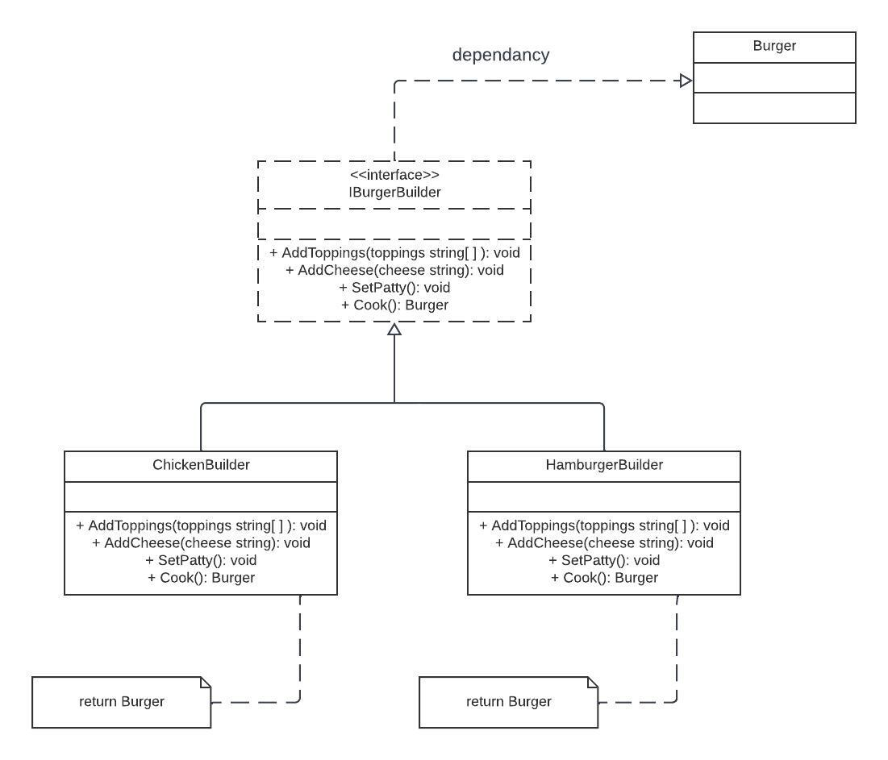

# Builder Design Pattern

The Builder design pattern is a creational pattern that separates the construction of complex objects from their representation. It allows you to create different variations of an object by specifying its type and content. This pattern is especially useful when an object has a large number of possible configurations, and it provides a clear separation between the client code and the construction of objects.

**Why Use Builder Method**:
- **Separation of Concerns**: Builder separates the construction process from the client code, making it easier to manage complex object creation.
- **Parameter Flexibility**: It allows you to create objects with different configurations, making it suitable for cases with optional parameters.
- **Immutable Objects**: Builder can be used to create immutable objects, ensuring their state remains consistent.

**Real Examples of Builder Method**:

1. **Document Builders**:
    - Document processors like Markdown, HTML, and PDF generators use the builder pattern to construct complex documents with various formatting options.

2. **Message Builders**:
    - In software systems, builders are often used to construct messages, emails, or notifications with customizable content and formatting.

3. **Meal Orders**:
    - Fast-food restaurants may use the builder pattern to construct customer orders, allowing customers to choose different components (e.g., type of burger, toppings, sides) for their meals.

4. **Fluent APIs**:
    - Fluent interfaces, which allow method chaining for configuring and building objects, are a common implementation of the builder pattern. They are used extensively in various libraries and frameworks.

## Implementation

In this Go package, we have implemented the Builder design pattern for creating customizable burgers. Let's break down the key components:

- **Burger**: The `Burger` struct represents a customizable burger with properties like `Patty`, `Toppings`, and `Cheese`.

- **IBurgerBuilder**: The `IBurgerBuilder` interface defines the methods for building custom burgers. It includes methods for adding toppings, adding cheese, setting the patty type, and cooking the burger.

- **getBuilder**: The `getBuilder` function returns a specific burger builder based on the type provided (e.g., "hamburger" or "chicken").

- **Concrete Builders**: We have two concrete builders: `HamburgerBuilder` and `ChickenBuilder`. These builders implement the `IBurgerBuilder` interface to construct custom burgers based on user preferences.

## Usage

To use the Builder pattern for creating custom burgers, follow these steps:

1. **Choose Builder**: Call the `getBuilder` function with the desired builder type ("hamburger" or "chicken") to get the appropriate builder instance.

2. **Configure Burger**: Use the builder methods to configure the burger as needed. You can add toppings, cheese, and set the patty type.

3. **Build Burger**: Call the `Cook` method to build the custom burger. The resulting burger object will have the specified configuration.

## Diagram
This is a simplified UML diagram of the Builder design pattern implemented in this Go package:  

The diagram illustrates the relationships between the `Burger`, `IBurgerBuilder`, `HamburgerBuilder`, and `ChickenBuilder` components. It shows how the builder interface is used to construct custom burger objects.

**Note**: The diagram above is a simplified representation. In practice, a more detailed diagram could include additional elements and relationships.
