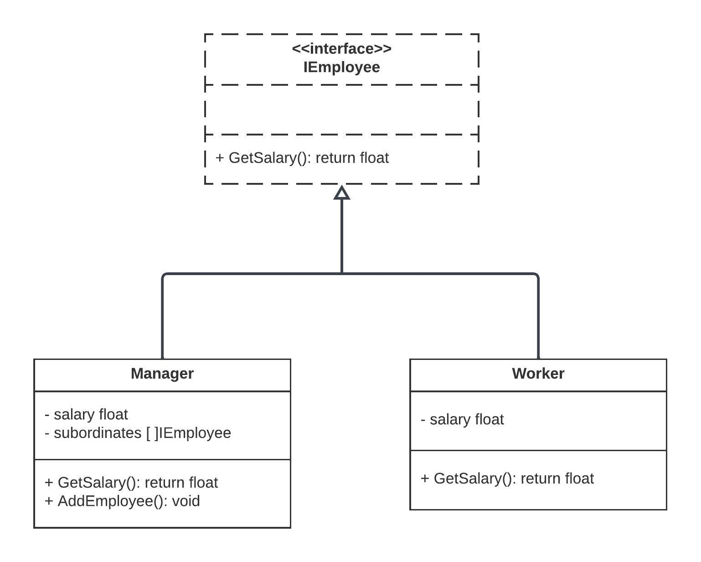

# Composite Design Pattern

The Composite Design Pattern is a structural design pattern used to compose objects into tree structures to represent part-whole hierarchies. It allows you to treat individual objects and compositions of objects uniformly. The pattern is particularly useful when dealing with hierarchical structures and when clients need to work with both individual components and their compositions in a consistent manner.

## Why Use the Composite Design Pattern

- **Hierarchy Representation**: It enables the representation of hierarchical structures in a way that individual objects and compositions of objects can be managed uniformly.

- **Simplifying Complex Structures**: It simplifies the client's code by allowing them to work with complex structures of objects without having to distinguish between individual objects and their compositions.

- **Recursive Operations**: It facilitates recursive operations on the hierarchical structure, making it easy to perform actions on entire hierarchies of objects.

## Real Examples of Composite Design Pattern

1. **Graphic Design Software**: In graphic design applications, the Composite pattern is used to represent complex shapes composed of simpler shapes, allowing users to manipulate both individual shapes and the composite shapes.

2. **File Systems**: In file systems, the Composite pattern can be used to represent files and directories as a hierarchical structure. Operations like calculating the total size of a directory or navigating the file system become easier to implement.

3. **Organization Hierarchy**: In HR or organization management software, the Composite pattern can represent an organization's hierarchy, with individual employees and departments as components of the structure.

4. **Menu Systems**: In user interface development, the Composite pattern can be employed to create menu systems where menu items can be both individual menu options and sub-menus.

## Overview of Provided Code

The provided Go code demonstrates the Composite Design Pattern with an organization hierarchy. Here's a brief overview:

- `Employee`: An interface defining a common `GetSalary()` method for all employees.

- `Worker`: A struct representing individual employees with a specific salary. Implements the `Employee` interface.

- `Manager`: A struct representing composite employees (managers) that can have subordinates. Implements the `Employee` interface. It can calculate the total salary by summing up the salaries of subordinates and adding its own salary.

- `NewWorker()` and `NewManager()`: Constructor functions for creating worker and manager instances, respectively.

- `AddEmployee()`: A method to add subordinate employees to a manager's list of subordinates.

This code serves as a simplified example of the Composite Design Pattern in Go, where both individual employees and managers are treated uniformly within the organization hierarchy, demonstrating the core concept of the pattern.  

## Diagram
