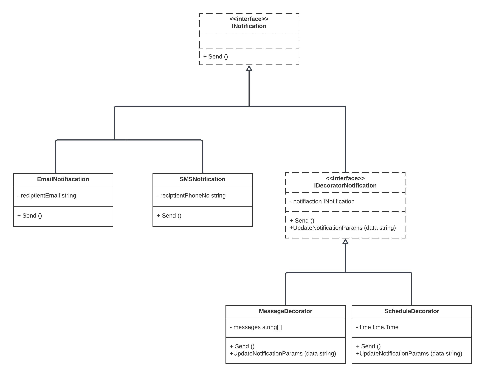

# Decorator Design Pattern

The Decorator design pattern is a structural pattern that allows behavior to be added to individual objects, either statically or dynamically, without affecting the behavior of other objects from the same class. It is used to extend or augment the capabilities of objects by wrapping them in one or more decorator classes. Decorators provide a flexible alternative to subclassing for extending functionality.

**Why Use Decorator Design Pattern**:
- **Open/Closed Principle**: It follows the Open/Closed Principle, allowing you to add new functionality to an object without modifying its structure.
- **Single Responsibility Principle**: It promotes the Single Responsibility Principle by separating the concerns of an object into different decorators.
- **Code Reusability**: Decorators can be reused to add different combinations of behaviors to objects.

**Real Examples of Decorator Design Pattern**:

1. **I/O Streams in Java**:
    - In Java, the `java.io` package uses decorators to add functionality to streams. For example, you can add buffering, compression, or encryption to a file stream using decorator classes.

2. **Graphics Libraries**:
    - Graphics libraries often use decorators to add various rendering effects to graphical objects, such as borders, shadows, and transparency.

3. **Web Development Middleware**:
    - In web development, middleware components can be implemented as decorators to add features like authentication, logging, and caching to HTTP request handlers.

4. **Text Processing Libraries**:
    - Text processing libraries may use decorators to add formatting, filtering, or transformation functionality to text streams.

## Implementation

In this Go package, we have implemented the Decorator design pattern to enhance the functionality of notification objects. Here are the key components:

- **INotification Interface**: This interface represents the core notification functionality with a `Send` method.

- **Concrete Notification Types**: We have two concrete notification types: `EmailNotification` and `SMSNotification`. These types implement the `INotification` interface to send email and SMS notifications, respectively.

- **IDecoratorNotification Interface**: This interface defines the methods for notification decorators, including `Send` and `UpdateNotificationParams` to add additional functionality.

- **MessageDecorator**: This decorator adds messages to a notification. It wraps an existing notification and extends its functionality by allowing messages to be added.

- **ScheduleDecorator**: This decorator adds scheduling information to a notification. Similar to `MessageDecorator`, it extends an existing notification with scheduling details.

## Usage

To use the Decorator pattern for enhancing notification objects, follow these steps:

1. **Create a Core Notification**: Start with a core notification object, such as an `EmailNotification` or `SMSNotification`.

2. **Create Decorators**: Create decorator objects (e.g., `MessageDecorator`, `ScheduleDecorator`) that wrap the core notification. Decorators implement the `IDecoratorNotification` interface.

3. **Wrap Core Notification**: Wrap the core notification with one or more decorators to add desired functionalities.

4. **Use Decorated Notification**: Use the decorated notification as if it were the original core notification. The decorators transparently enhance its behavior.

## Code Overview

The provided code demonstrates how decorators can be used to enhance notifications. It includes concrete notification types (`EmailNotification` and `SMSNotification`) and decorators (`MessageDecorator` and `ScheduleDecorator`) that add messages and scheduling information to notifications.

The `UpdateNotificationParams` method in decorators allows the dynamic addition of messages and scheduling details, making it a flexible way to extend notification objects.

In testing, we create instances of core notifications, decorate them with decorators, and verify that the combined functionality works as expected.

The Decorator pattern showcased here provides a clear separation of concerns and allows for easy extension of notification objects with additional features, all while adhering to the Open/Closed Principle.  

## Diagram  

  

