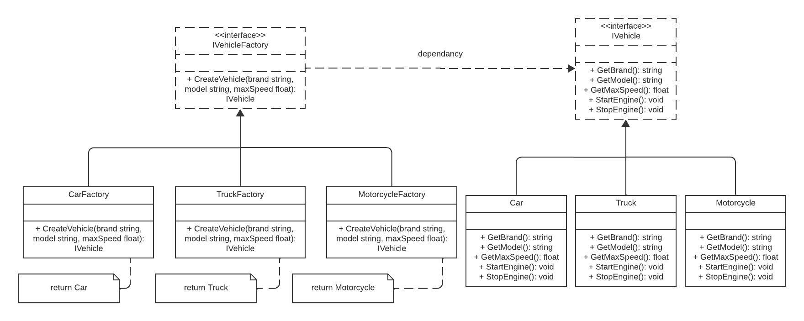

# Factory Method Design Pattern

The Factory Method design pattern is a creational pattern that provides an interface for creating objects but allows subclasses to alter the type of objects that will be created. It promotes loose coupling between the creator (factory) and the products (objects) it creates, allowing for extensibility and flexibility in object creation.

**Why Use Factory Method**:
- **Abstraction and Encapsulation**: It abstracts the object creation process, encapsulating the responsibility of object creation in the factory class.
- **Flexibility**: It allows you to create objects of different types by extending or implementing the factory method in subclasses.
- **Dependency Injection**: Factory methods facilitate dependency injection, making it easier to switch between different implementations of an object.

**Real Examples of Factory Method**:

1. **GUI Frameworks**:
    - GUI frameworks often use the Factory Method to create various UI elements like buttons, windows, and dialogs.
    - Each platform (e.g., Windows, macOS, Linux) can have its own factory for creating platform-specific UI components.

2. **Document Generation**:
    - In document generation libraries, a factory method can create different types of documents (e.g., PDF, HTML, Word) based on user requirements.

3. **Payment Processors**:
    - Payment gateway integrations often use factory methods to create payment processors specific to different payment providers (e.g., PayPal, Stripe, Square).

## Implementation

In this Go package, we have implemented the Factory Method design pattern to create various types of vehicles, including cars, trucks, and motorcycles. Let's break down the key components:

- **Vehicle Interface**: We've defined a core interface called `Vehicle`. This interface represents all types of vehicles and enforces a consistent structure. It includes essential methods such as `StartEngine()`, `StopEngine()`, and accessors for retrieving the brand, model, and maximum speed of the vehicle.

- **Concrete Vehicle Types**: We have three concrete vehicle types: `Car`, `Motorcycle`, and `Truck`. Each type corresponds to a specific kind of vehicle and is implemented as a struct. These types contain attributes like brand, model, max speed, and an `EngineRunning` flag. They also implement the methods defined in the `Vehicle` interface to provide specific functionality for each vehicle type.

- **VehicleFactory Interface**: To facilitate the creation of vehicles, we've introduced the `VehicleFactory` interface. This interface defines a factory method named `CreateVehicle()`. The purpose of this factory is to create instances of vehicles based on provided attributes.

- **Concrete Vehicle Factories**: We've included three concrete factories that implement the `VehicleFactory` interface. These factories are specialized in creating particular vehicle types. Specifically, we have:
   - `CarFactory`: Responsible for creating car instances.
   - `TruckFactory`: Responsible for creating truck instances.
   - `MotorcycleFactory`: Responsible for creating motorcycle instances.

## Usage

To apply the Factory Method pattern, follow these steps:

1. **Create Factory**: Instantiate an object of the desired factory type (`CarFactory`, `TruckFactory`, or `MotorcycleFactory`).

2. **Invoke Factory Method**: Call the `CreateVehicle()` method on the factory, specifying the brand, model, and maximum speed of the vehicle you want to create. Provide the appropriate parameters based on the vehicle type you intend to instantiate.

3. **Receive Vehicle**: The factory method will return an instance of the requested vehicle type. This mechanism ensures that the correct type of vehicle is created based on the provided format.

## Diagram
This is the UML diagram of factory method implemented in this go package.  

