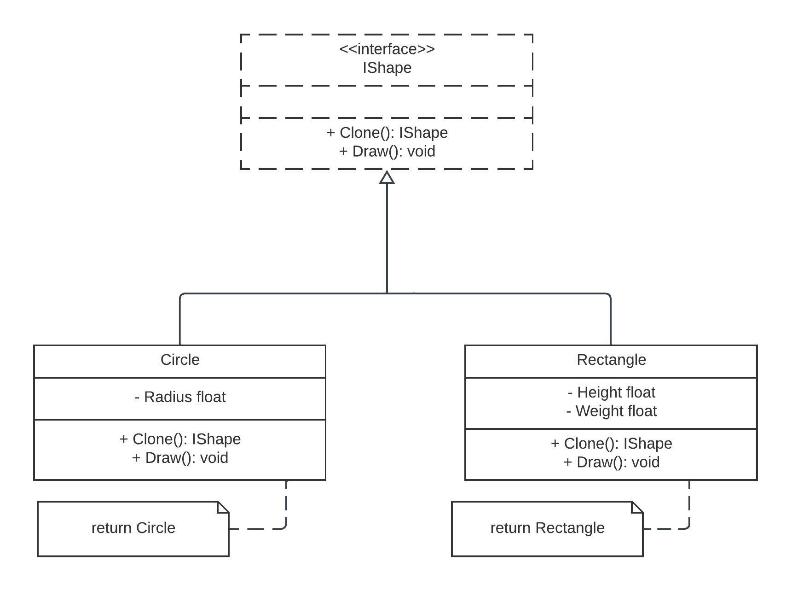

# Prototype Design Pattern

The Prototype design pattern is a creational pattern that allows you to create new objects by copying an existing object, known as the prototype. This pattern is useful when the cost of creating an object is more expensive than copying an existing one. It allows you to create new objects with the same state as an existing object, making it easier to manage and customize object creation.

**Why Use Prototype**:
- **Efficiency**: Prototype helps avoid the cost of initializing objects from scratch by copying existing instances.
- **Flexibility**: It allows you to create new objects by modifying cloned prototypes, providing a flexible way to create variations of objects.
- **Reduced Coupling**: The pattern reduces coupling between clients and specific classes, as clients can work with prototypes without needing to know their concrete classes.

**Real Examples of Prototype**:

1. **Document Cloning**:
    - In word processing or document editing software, the Prototype pattern can be used to clone existing documents. Users can create new documents based on a template or an existing document's structure and content.

2. **Graphic Design Software**:
    - Graphic design applications often use prototypes to create multiple instances of graphic objects (e.g., shapes, icons) with similar properties and styles.

3. **Game Development**:
    - In game development, the Prototype pattern can be applied to create new game characters or entities based on existing character prototypes. This allows for efficient creation of various in-game assets.

## Implementation

In this Go package, we have implemented the Prototype design pattern to create and clone two types of shapes: `Circle` and `Rectangle`. Here are the key components:

- **IShape Interface**: We've defined an interface named `IShape`, which includes two methods: `Clone()` and `Print()`. This interface represents any shape that can be cloned and printed.

- **Circle and Rectangle Structs**: We have two concrete shape types: `Circle` and `Rectangle`. Each shape type implements the `IShape` interface by providing its own `Clone()` and `Print()` methods.

- **NewCircle and NewRectangle Functions**: These functions are used to create new instances of `Circle` and `Rectangle`. They serve as factory methods for creating shape prototypes.

- **Clone Method**: The `Clone()` method in each shape type returns a new instance of the same shape type with the same properties as the original, allowing for easy cloning of shapes.

- **Print Method**: The `Print()` method is responsible for printing information about the shape.

## Usage

To use the Prototype pattern with these shapes, follow these steps:

1. **Create Shape Prototypes**: Use the `NewCircle` and `NewRectangle` functions to create prototype instances of `Circle` and `Rectangle` shapes.

2. **Clone Prototypes**: When you need a new shape, clone an existing prototype using its `Clone()` method. This will create a new shape with the same properties as the prototype.

3. **Customize Cloned Shapes**: Modify the properties of the cloned shape as needed to create variations.

4. **Print Shape Information**: Use the `Print()` method to display information about each shape.

## Code Overview

The provided code defines the `IShape` interface, concrete shapes (`Circle` and `Rectangle`), and demonstrates how to clone and print shape information. You can use this code as a basis for implementing the Prototype pattern in your applications.  

## Diagram
This is a simplified UML diagram of the Prototype design pattern implemented in this Go package:

