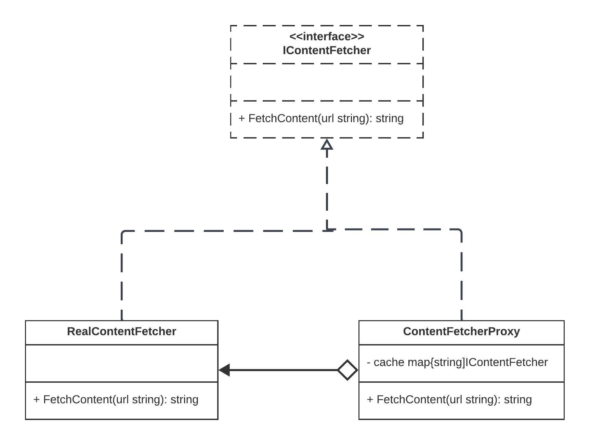

# Proxy Design Pattern

The Proxy design pattern is a structural pattern that provides a surrogate or placeholder for another object to control access to it. It allows you to add an extra layer of control and functionality to an object without changing its core behavior.

## Why Use Proxy?

- **Controlled Access**: Proxy can control access to the real object. It can add security, logging, or monitoring to protect or enhance the real object's functionality.

- **Lazy Loading**: Proxy can defer the creation or initialization of the real object until it is needed, improving performance by avoiding unnecessary resource consumption.

- **Caching**: Proxy can cache results of expensive operations, such as database queries or network requests, and return cached data when requested again.

- **Remote Access**: Proxy can act as a local representative for a remote object, handling network communication and making remote resources appear as local objects.

## When to Use Proxy?

- Use Proxy when you want to control access to an object, especially when you need to add security, logging, or monitoring around that access.

- Use Proxy when you want to delay the creation or initialization of an object until it is actually needed to improve performance.

- Use Proxy when you want to cache results to avoid redundant calculations or expensive operations.

- Use Proxy when you need to represent a remote object locally, providing a local interface to interact with remote resources.

## Real-World Examples

1. **Virtual Proxy in Image Loading**: In web browsers, a virtual proxy can be used to delay the loading of large images until they are actually viewed by the user.

2. **Remote Proxy in Remote Method Invocation (RMI)**: In distributed systems, remote proxies are used to represent remote objects locally, allowing method calls on the local proxy to be forwarded to the remote object.

3. **Cache Proxy in Database Access**: In database systems, cache proxies can store frequently accessed database records, reducing database load and speeding up query results.

4. **Access Control Proxy in File Systems**: In operating systems and file systems, access control proxies can restrict access to files and directories based on user permissions.

## Implementation

In the provided Go code example, we implement a simple caching proxy using the Proxy design pattern. The `ContentFetcherProxy` acts as a proxy for the `RealContentFetcher`. It caches fetched content to improve performance by avoiding redundant fetches.

## Code Description

- The `RealContentFetcher` represents the real implementation of content fetching.

- The `ContentFetcherProxy` is the proxy for content fetching. It caches content and delegates fetching to the real object when needed.

By using the Proxy pattern, the code demonstrates how to control access to the real content fetcher and provide caching functionality, enhancing the performance of content retrieval. This code is a basic example to illustrate the Proxy pattern's concept.  

## Diagram  

