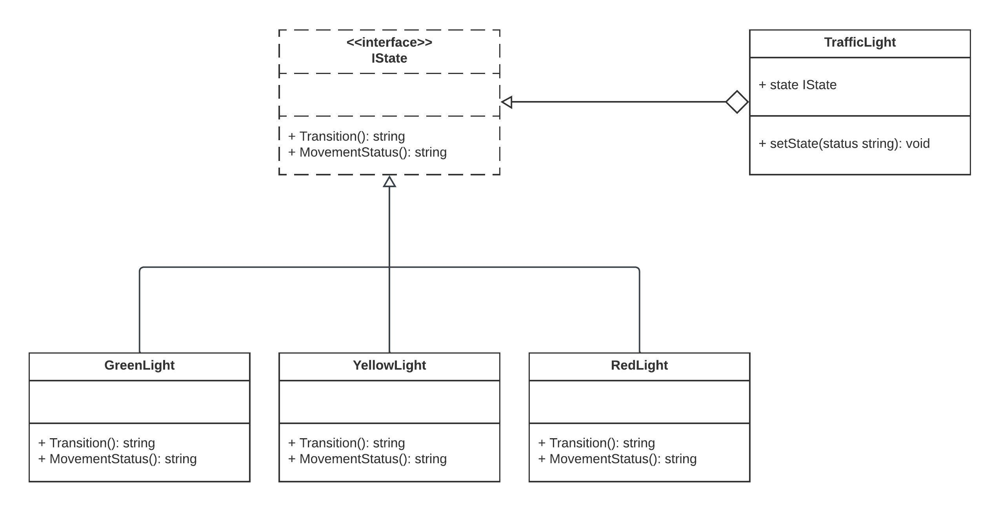

# State Design Pattern

The State design pattern is a behavioral pattern that allows an object to alter its behavior when its internal state changes. It encapsulates the behavior of an object into separate state classes and allows the object to switch between these states dynamically. This pattern is particularly useful when an object's behavior needs to change based on its internal state without altering its interface.

## Why Use State?

- **Clean State Transitions**: State pattern helps in organizing code related to each state in separate classes, resulting in cleaner and more maintainable code.

- **Flexibility**: It allows an object to change its behavior at runtime based on its internal state, making it flexible and adaptable.

- **Reduced Conditional Statements**: State pattern reduces the need for extensive conditional statements to manage an object's behavior, leading to improved code readability.

- **Easier Testing**: Testing individual state classes is as easy as their behavior is isolated from the context.

## When to Use State?

- Use State when an object's behavior changes significantly based on its internal state, and you want to avoid creating a monolithic class with numerous conditional statements.

- Use State when you need to encapsulate and separate the behavior of an object for better maintainability.

- Use State when you want to allow an object to transition between states dynamically at runtime.

## Real-World Examples

1. **Traffic Light Control System**: A traffic light can be modeled using the State pattern. Each color (Green, Yellow, Red) represents a state, and the traffic light transitions between these states based on a predefined sequence or external factors.

2. **Document Editing Software**: Document editing software can use the State pattern to manage different editing modes such as Insert Mode, Edit Mode, and Command Mode. Each mode is a state with its own behavior.

3. **Order Processing System**: In an e-commerce system, order processing can involve multiple states like "Pending," "Shipped," and "Delivered." The State pattern can be used to manage the order's state transitions and associated behavior.

4. **Media Player**: A media player can change its behavior based on the playback state, such as "Playing," "Paused," or "Stopped." The State pattern can be employed to handle transitions and actions associated with each state.

## Implementation

In the provided Go code example, we implement a simple traffic light control system using the State design pattern. Three states, `GreenLight`, `YellowLight`, and `RedLight`, represent the different states of a traffic light. The `TrafficLight` context manages the current state and transitions between them based on external factors.

## Code Description

- The `IState` interface defines methods `Transition` and `MovementStatus`, which represent the behavior associated with each state.

- Three state classes (`GreenLight`, `YellowLight`, and `RedLight`) implement the `IState` interface, providing specific behavior for each state.

- The `TrafficLight` context holds the current state and uses the `setState` method to transition between states based on external input.

This code demonstrates how to implement the State pattern to manage a traffic light's behavior and state transitions dynamically. It follows the principles of encapsulation and separation of concerns, making it easy to extend and maintain as the project evolves.  

## Diagram  

  

