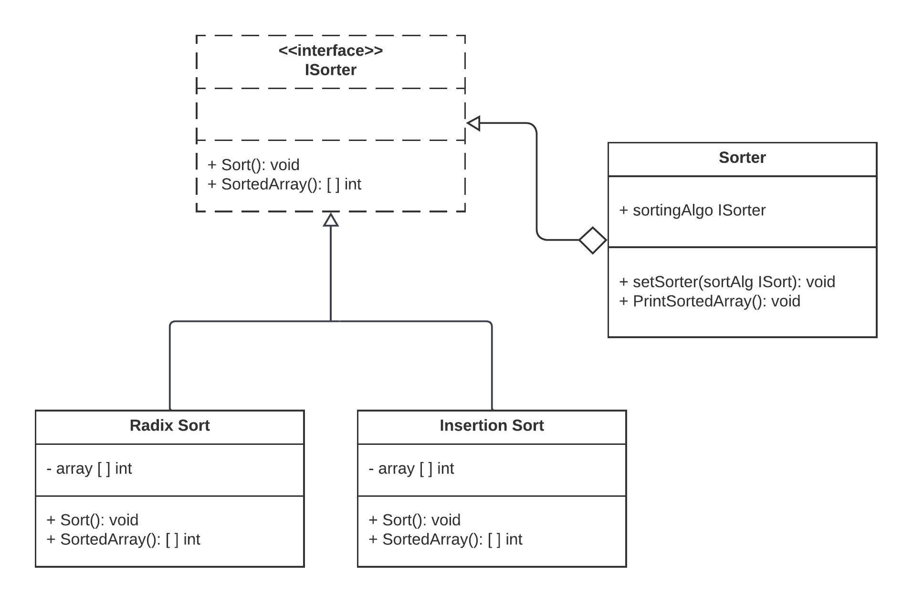

# Strategy Design Pattern

The Strategy design pattern is a behavioral pattern that provides a way to define a family of algorithms, encapsulate each one of them, and make them interchangeable. This pattern allows the client to choose the appropriate algorithm at runtime, enabling dynamic behavior changes without altering the client's code.

## Why Use Strategy?

- **Flexibility**: The Strategy pattern offers flexibility by allowing you to change the behavior of an object dynamically at runtime. It promotes code modularity and reusability.

- **Separation of Concerns**: It separates the algorithms from the context that uses them, promoting a clean and maintainable codebase.

- **Testability**: Each strategy can be tested in isolation, making it easier to ensure the correctness of individual algorithms.

- **Extensibility**: It's easy to add new strategies without modifying existing code.

## When to Use Strategy?

- Use Strategy when you have multiple algorithms for a specific task, and you want to make them interchangeable at runtime.

- Use Strategy when you want to encapsulate the behavior of an object and make it independent of the client code that uses it.

- Use Strategy when you want to avoid conditional statements that determine an object's behavior.

## Real-World Examples

1. **Payment Processing**: Payment gateways can implement the Strategy pattern to handle different payment methods (credit card, PayPal, bank transfer) as interchangeable strategies.

2. **Image Compression**: Image processing software can use the Strategy pattern to apply various compression algorithms (JPEG, PNG, GIF) to images.

3. **Sorting Algorithms**: Sorting libraries often use the Strategy pattern to allow users to select from various sorting algorithms (e.g., quicksort, mergesort) based on their specific needs.

4. **Travel Booking Systems**: In travel booking applications, the pricing strategy can vary based on factors like seat availability and booking class. The Strategy pattern can be used to handle pricing calculations.

## Implementation

In the provided Go code example, we implement the Strategy design pattern for sorting algorithms. The `InsertionSort` and `RadixSort` classes represent concrete sorting strategies, and the `Sorter` context class uses a sorting strategy to sort an array of integers.

## Code Description

- The `ISort` interface defines the methods required for a sorting strategy, including `Sort` and `SortedArray`.

- Two concrete sorting strategies, `InsertionSort` and `RadixSort`, implement the `ISort` interface, providing specific sorting algorithms.

- The `Sorter` context class uses a sorting strategy set via the `setSorter` method and can print the sorted array using the `PrintSortedArray` method.

This code illustrates how the Strategy pattern can be employed to encapsulate sorting algorithms and dynamically switch between them, promoting code flexibility and maintainability.

## Diagram

In this diagram, `ISort` defines the strategy interface, and `InsertionSort` and `RadixSort` are concrete strategies. The `Sorter` class is the context that uses a sorting strategy.